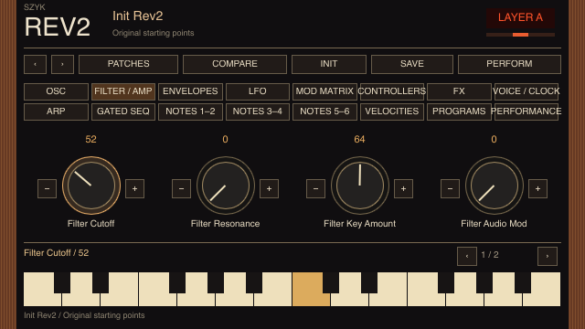

# Rev2 implementation audit — 8 October 2026

The audit began from GitHub `Szyk-fi/SZYK` main at
`977d8c37dab2e8dd874943fe73e60c6a85c86dbc`, independently checked against the
main checkout before any edits. Changes are isolated on
`gpt/rev2-parameter-ui-audit`. The main checkout's imported patches and dirty
Eurorack submodule were preserved.

## Corrected faults

| Area | Previous behavior | Corrected behavior / evidence |
|---|---|---|
| Launcher | Sorted internal `prophet` id under P | Sort visible names; Rev2 appears under R. Combined built-in/cartridge roots keep first-id priority and sort together. |
| Layer mode | Wire 1 = Split, 2 = Stack | Hardware 0 = Normal, 1 = Stack, 2 = Split. Original starting points retagged to preserve their intended mode. |
| Multi | Forced the old mode 2, implicitly applying a split | Channel A/B routing now uses the stack path without splitting by note number. |
| LFO free rate | Values above 127 unexpectedly switched to clock sync | Full 0–150 free range; only the Clock Sync flag selects sync. Free frequency taper remains approximate. |
| LFO sync rate | Clock divisions selected by subtracting 128 | Hardware editor divides the dial into nine-value bands, from 32 sequencer steps to 1/16 step. Values 144–150 share the last division. |
| Env3 Amount | Its modulation destination was calculated but ignored by the direct Env3 route | Previous control tick's amount modulation reaches Env3's destination, like other amount-to-amount paths. |
| Pan modulation | Alternate still added a uniform stereo offset | Alternate changes individual-voice spread; Fixed moves the entire program, as specified in the manual. |
| VCA modulation | Silent voices returned before evaluating modulation | Matrix/DC VCA routes can open the amplifier without a note gate. Ordinary idle patches remain silent. |
| Free oscillators / drift | Idle voices froze their oscillator phase and slop | Phases and independent drift continue through silence. Fully released voices rotate by oldest use instead of always reusing voice zero. Note Reset still resets the requested oscillator. |
| Slop depth | Maximum ±12 cents | Approximate maximum ±4 semitones, consistent with published firsthand observations. Quadratic amount taper, random targets 4–20 seconds apart and a 3-second slew are software choices, not recovered firmware. |
| Absolute filter cutoff | Wrong pitch offset and keyboard reference | One semitone per unit; no tracking: 105 ≈ 440 Hz; cutoff 24 + Key Amount 64 tracks the played note. Lower cutoff is no longer pinned at 5 Hz. |
| Amp attack | Generic exponential table made middle values too fast | Interpolate measured VCA attack anchors: 0 ≈ 3 ms, 63 ≈ 605 ms, 127 ≈ 24.66 s. Envelope shape and other stages remain approximate. |
| Sub/noise levels | Negative modulation inverted their signals | Negative levels mute the source instead. |
| FX limits | Mix and Parameter 2 could reach 255 | Mix 0–127; Parameter 1 0–255; Parameter 2 0–127, as in Sequential's table. |
| Unison limit | Editable value 17 beyond Chord | Wire values 0–15 select 1–16 voices; 16 is Chord. Chord-memory decoding is still unsupported. |
| Gated steps | First step of each track could reach 255 | All gated step bytes use 0–127, including reset/rest sentinels. |
| BPM | Edits could reach zero | UI/parameter writes enforce 30–250. Import still preserves original bytes. |
| Global offsets | Layer-B NRPN aliases could edit reserved bytes | Layer Mode and Split Point are global, raw A offsets 231/232. B aliases are rejected. Reserved imported bytes remain intact. |
| Poly velocities | Raw 128 played velocity 1; raw 255 played velocity 128 | Raw ≤127 = Reset, 128 = Rest, 129–255 = velocity 1–127. Step recording and labels now use the same encoding; reset ends the sequence regardless of its note byte. |
| Slint | Generic list/framebuffer display | A real dedicated panel with wood sides, dark faceplate, amber readouts, four knobs, patch toolbar, all sixteen sections/pages, layer controls and piano keys. Mouse press/release reaches real note state. |

The previously merged pitch-route correction was confirmed: direct LFO pitch
amount has 0.125-semitone resolution, whereas matrix and auxiliary-envelope
pitch amounts have 0.5-semitone resolution. Bipolar/unipolar LFO waveforms,
independent layer seeds, the square suboscillator, filter body, auxiliary looping,
chorus wet taps and diffuse stereo reverb corrections remain in place.

The manual labels its last clock division **64 Trip**, but explicitly specifies
BPM ×16. This implementation follows that published multiplier (1/16 beat),
not the mathematically inferred ×24. Native imported bytes are never retuned.
The original software Init/cutoff starting points were retuned in raw units to
retain their earlier intended filter position; Warm Stack also adds subtle
independent slop. Existing saved software presets can sound different because
playback now interprets their bytes more closely to hardware semantics.

## Parameter and preset alignment

[rev2-parameters.csv](rev2-parameters.csv) enumerates all 201 scalar/gated-step
entries and 768 poly-sequence note/velocity entries per layer, with raw offsets,
NRPN numbers, ranges and encodings. Every A raw-to-NRPN name and all 199 B
scalar mappings were independently compared with Edisyn's editor table. The two
remaining scalar entries are global, not B parameters. Choices/ranges were
checked against Sequential's manual and the editor's actual controls; some
comments in the editor are stale (notably LFO shape and FX Parameter 2).

The codec retains the exact 2,046 transmitted raw bytes, reserved bytes, names,
locations and both layers. Tests independently cover 7-bit packing, concatenated
banks, real-time MIDI interleaving and byte-exact export. The final two B
track-six velocities, raw offsets 2046/2047, are absent from native program dumps.
Their CSV NRPN entries describe addressable state, not additional SysEx payload.
The app warns rather than pretending it can save those bytes in this format.

Lossless import and correct IDs do **not** establish identical sound. There are
still real gaps: undocumented chord-memory voicings; independent per-channel
Multi controller state; NRPN names and per-layer sequence transport; exact shared
clock phase and pedal modes; full real-time recording/overdub; request/reply
librarian operations; Prophet '08 conversion and custom tuning dumps. These are
listed in [PROPHET.md](PROPHET.md), not silently represented as supported.

## Circuit and chipset research

Sequential's [announcement](https://sequential.com/2017/01/prophetrev2-16-voice-poly-synth/)
and [manual](https://sequential.com/wp-content/uploads/2021/02/Prophet-Rev2-Users-Guide-1.2.4.pdf)
confirm two DCOs, a square suboscillator, analog amplifiers and resonant Curtis
2/4-pole filters per voice, plus a digital effects stage. The 4-pole filter can
self-oscillate; the 2-pole mode is not specified to do so.

No authenticated public **modern Prophet Rev2** service schematic or confirmed
chip transfer curves were located in this search. Older Prophet-5 revision-2
service drawings describe a different instrument and cannot justify replacing
this app's filter with an SSM2040 model. PA397/DSI120/CEM3397 identifications and
Coolaudio V3397 comparisons require confirmed board/revision documentation before
using them as circuit evidence. A generic chip datasheet alone does not establish
the Rev2's surrounding resistors, drive levels, biasing, calibration or response.

Circuit topology does matter: oscillator waveshaping, resonance gain, signal
levels, nonlinear filter/VCA behavior and digital effects determine much of the
perceived warmth. This audit corrects documented controls and measured anchors.
The existing software filter is still an original four-stage/two-stage model,
not a solved schematic or calibrated Curtis simulation. Exact resonance/drive,
shape-modulation transfer, slop taper, envelope/LFO curves, unison detune and FX
algorithms need matched hardware recordings. No speculative chip-based change
was presented as hardware equivalence.

## Verification

Validation results and reproducible commands are recorded in the work log and
[PROPHET.md](PROPHET.md). The headless Slint renderer uses the actual panel and
app state; it checks parameter editing, tab/page/layer callbacks and separate
keyboard press/release events, then renders all sixteen sections. Actual display
captures are in `docs/images/`.

The final broad run passed **1,201 tests**, including all **54 focused Rev2
regressions** and Atlas factory-preset compile/play/morph checks, with 14
ignored and 3 explicitly excluded tests. The optional Edisyn init
dump also imports, exports byte-for-byte and plays successfully. Two socket
integration tests cannot bind UDP ports in this sandbox; the previously documented
Norns bundled-script test was excluded because it stalls.

The external audio harness renders all sixteen original starting points and 440
imported user patches, with single notes and four-note chords, asserting finite
bounded samples. Maximum imported chord peak was 0.63861, with no samples
above 0.95. Those user banks are not committed. This is a numerical safety
and playback check, not a substitute for listening to matched hardware.

## Sources

- [Sequential guide 1.2.4](https://sequential.com/wp-content/uploads/2021/02/Prophet-Rev2-Users-Guide-1.2.4.pdf): architecture, parameters, MIDI, pan modes, clock multipliers.
- [Edisyn Rev2 editor](https://github.com/eclab/edisyn/blob/master/edisyn/synth/sequentialprophetrev2/SequentialProphetRev2.java): independent raw-offset map and native sequencer encoding. Consulted as protocol evidence; no editor DSP copied.
- [CreativeSpiral's firsthand measurements](https://forum.sequential.com/index.php?topic=3203.0): pitch resolution, drift behavior, filter tuning and approximate VCA attack anchors. Measurements are observations, not Sequential's firmware specification.
- [Sequential Rev2 support documentation](https://sequential.com/support/download/prophet-rev2-documentation/) and [support index](https://sequential.com/support/): public manufacturer documentation checked during the schematic search.

## Applying and running

The GitHub integration rejected branch creation with HTTP 403 (Resource not
accessible by integration). This session also cannot write to Max's main
checkout, so it has not been updated by this audit.

Run `bash tools/apply-rev2-audit.command --run` from this audit checkout. The
script checks main, tracked changes and the latest GitHub head before applying
a fast-forward from this branch; it stops if main advanced after the audit.
It then launches `cargo run --offline --example slint_home_live`. Existing
imported patches and the modified Eurorack worktree are preserved.
